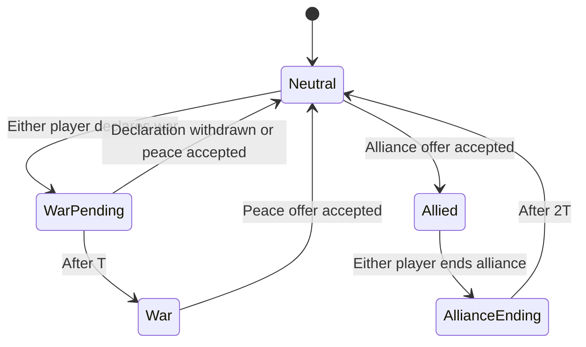

# Light vs Dark diplomacy design

Status: core relationships, BASIC commands, configurable delays, shared vision,
and deterministic replays are implemented. The menu and notification
presentation below remain a UI design.

This design assumes the request meant that allies cannot attack each other.
Only players at war may damage one another. Diplomacy is independent of
Light/Dark art, player colors, and player count.

## Relationships and timing

Each pair of living players has one symmetric relationship. Everyone starts
neutral. Declaring war affects both players, so the recipient can fight back
as soon as the same countdown completes.

Use one match setting, `warGraceSeconds`, default 10 simulation seconds.
Leaving an alliance takes exactly twice that setting. Store deadlines in
ticks, not wall-clock time. Pausing freezes them; playback speed scales them
with the rest of the simulation. Settings are fixed at match start.

| Relationship | Can attack each other | Share live vision | Available actions |
| --- | --- | --- | --- |
| Neutral | No | No | Declare war, offer alliance |
| War pending | No | No | Declarer can withdraw; either side can offer peace |
| At war | Yes | No | Offer peace |
| Allied | No | Yes | End alliance |
| Alliance ending | No | Yes, until the deadline | Wait for neutrality |

With the defaults, declaring war on a neutral player takes 10 seconds.
Leaving an alliance takes 20 seconds, followed by a separate war declaration
and its 10-second warning. Former allies cannot fight sooner than 30 seconds
after the withdrawal starts. The UI does not silently queue a war afterward.

Repeated declarations never shorten, restart, or extend a deadline. The
recipient cannot skip the warning by declaring war back. Withdrawing a
declaration prevents that player from redeclaring against the same target
for T, avoiding repeated warning spam. An alliance
withdrawal cannot be vetoed or restarted, and it completes even if the
initiator disconnects. Its countdown is not cancellable in the first version.

## Peace and alliance offers

Peace requires agreement. Sending an offer changes no combat permissions.
The recipient gets Accept and Decline actions. Acceptance returns both
players to neutral immediately; rejection leaves the relationship intact.
A peace offer sent during a war warning can still be accepted after war
starts, until the offer expires.

An alliance offer is available only while neutral. Acceptance immediately
enables shared vision. Players at war must first agree to peace, then agree
to an alliance. Alliances do not transfer units, resources, build permissions,
or control of another player's army.

Each pair has at most one open offer. Offers expire after 60 simulation
seconds by default, configurable as `diplomacyOfferSeconds`. The sender can
withdraw an offer. Matching crossed offers count as mutual acceptance.
Acceptance names the exact offer ID, so a stale click cannot accept a later
offer. Declaring war clears a pending alliance offer.

Repeated identical offers do not reset their expiry or send another alert.
After an offer is declined, expires, or is withdrawn, its sender waits T
before offering to that player again. Invalid commands change no state and
produce no notification. Defeat clears the player's outstanding diplomacy.

## Multiple allies and vision

Relationships are bilateral and do not propagate. If A allies with B, and B
allies with C, A and C keep their existing relationship. There are no forced
wars or automatic alliances. A cooperative group can establish all its
desired pacts, and members can leave those pacts independently.

A player sees the union of its own units' and buildings' vision and that of
its direct allies. Use actual sight sources, not allies' already merged
vision, to avoid unintentionally revealing allies of allies. An ally may
still see something through its own scouts and legitimately share it.

Shared vision remains active during the alliance withdrawal countdown and
ends exactly when neutrality takes effect. Previously revealed terrain
remains explored, but moving units and buildings stop receiving live updates
outside the player's remaining vision. Forming an alliance does not copy
the ally's entire historical explored map.

The same rules govern the world renderer, minimap, bot observations,
targeting, and fog-view controls. Alliances grant information, never a
permission to attack a neutral player visible through an ally.

## Diplomacy menu

Add a handshake button beside the minimap's view controls, using the existing
`diplomacy` icon, plus an F3 shortcut. Opening the menu does not pause the
match. Escape closes it before cancelling world commands. It captures mouse
input within its bounds, following the statistics overlay's existing rules.

Use a scrollable roster that works for any player count. Each row contains:

- Player number, name, and existing player-color marker.
- A labeled relationship icon: `neutral`, `alliance`, or `hostile`.
- A visible countdown for pending war or an ending alliance.
- Shared vision On/Off, shown with an eye icon and text.
- The actions available for the current relationship.

Place incoming offers above the roster, with the sender's name, offer type,
time remaining, Accept, and Decline. An unread count appears on the handshake
button. Opening an offer marks it read but never accepts it.

Example rows from P1's perspective:

| Player | Relationship | Vision | Actions |
| --- | --- | --- | --- |
| P2 Rowan | Neutral | Separate | Offer alliance, Declare war |
| P3 Mira | Allied | Shared | End alliance |
| P4 Ash | War starts in 7s | Separate | Offer peace |
| P5 Vale | At war | Separate | Offer peace |
| P6 Fern | Alliance ends in 14s | Shared until then | Countdown |

Declare war and End alliance use a short confirmation inside the menu,
showing the target and exact delay. Accepting or declining an offer does not
need another confirmation. Right-clicking a neutral unit never declares war
implicitly; attack orders report that war is required.

Human actions always act as the local human player, regardless of the
selected entity or fog view. Spectators and replay viewers can inspect
relationships and notifications from the selected player's perspective but
cannot submit commands. Defeated players remain visible with no actions.

## Notifications

Notify both affected players when an offer arrives or resolves, war is
declared or begins, or an alliance begins, starts ending, or ends.

Examples:

- "P3 Mira declared war on you. Fighting begins in 10 seconds."
- "You are now at war with P3 Mira."
- "P2 Rowan offers peace." with Accept and Decline.
- "P5 Vale offers an alliance. You will share vision."
- "P5 Vale is ending your alliance. Vision sharing ends in 20 seconds."

Show brief nonblocking notices near the minimap. Clicking one opens the
relevant player in the diplomacy menu. Keep the most recent 64 notices per
player, with unread state local to the UI. Pending offers live in match
state and remain actionable even if an older notice is evicted.

Countdowns and incoming offers are always readable in the menu. No modal
interruptions, automatic camera jumps, or global broadcasts are required.

## Combat and victory

Use one authoritative `atWar(first, second)` predicate everywhere: direct
attack orders, automatic acquisition, attack-move, chase retention, towers,
splash damage, and the final damage application. Checking only when an order
is issued is insufficient. A later peace agreement must prevent an already
queued attack from dealing damage.

On peace, clear now-invalid combat targets. Attack-move can resume its
movement destination; ordinary attack orders become idle. Other wars remain
active. Visual projectiles must not apply damage after peace. Neutral mines
and terrain retain their existing resource behavior.

Only individual victory counts. Being the last allied group does not end the
match or award a shared win. The current last-survivor condition and the
configured time-limit scoring remain in force. A timed match can still end
while players are allied; an alliance itself never triggers victory.

## Simulation and replay integration

Put the relationship types and transition procedures in
`examples/light_vs_dark/diplomacies.nim`. Keep one flat sequence of pair
records, with a canonical unordered-pair index. Do not create a fixed-size
team array or a class hierarchy. Validate allocation sizes at the boundary.

A pair record stores its state, transition initiator and deadline, optional
offer kind/sender/ID/expiry, and offer and declaration cooldowns. The world
stores diplomacy settings and the next offer ID. Include every authoritative field in cloning,
checkpoints, and the canonical world hash.

Extend the existing fixed tick pipeline:

1. Advance the tick and resolve relationship deadlines and expired offers.
2. Refresh vision, including changes to direct allies.
3. Apply human, bot, or replay commands in the existing deterministic order.
4. Refresh vision if those commands changed an alliance, and clear invalid
   targets before combat.
5. Run movement, unit combat, buildings, defeat cleanup, and state hashing.

Add alliance relationships to the vision cache's invalidation keys. The
current cache only watches terrain edits and sight-source entities, so an
alliance change with stationary armies otherwise leaves stale visibility.

Record diplomacy actions with their player, target player, and offer ID as
appropriate. Offers, replies, withdrawals, and alliance endings must replay
through the same validators. Derive deadline events from recorded settings
and ticks. Reconstruct notices when seeking without playing old alert sounds.
Increment gameplay and replay-format versions for the new authoritative
state, setup fields, and action payloads.

Add `--war-grace-seconds` and `--diplomacy-offer-seconds`, and equivalent
hosted configuration fields. Validate positive whole seconds and conversion
to ticks. Alliance withdrawal remains exactly twice the war grace setting.

## Bot interface

The bundled base policy and its hosted copy rank surviving opponents by
starting-base distance, breaking ties by player ID. For M opponents, the
farthest `min(M, floor(M / 2) + 1)` are preferred enemies and the rest are
preferred allies. With eight players, each prefers four wars and three
alliances. Bilateral declarations can produce more wars than that preference.

Reconsider once per simulated second and immediately after an elimination.
Ask new preferred allies for peace before offering an alliance. Accept peace
and alliance offers from preferred allies and decline them from preferred
enemies. End alliances with preferred enemies, wait for neutrality, and then
declare war with its full warning. Two or three survivors want war with every
opponent, so a final alliance cannot leave the policy peacefully stalled.

Expose diplomacy through the same command path used by the human UI:

- Roster: `neighborCount`, `neighbor(rank)`, and `tickRate`. Neighbors are
  living opponents ordered by starting-base distance; ranks begin at zero.
- Queries: `relation(player)`, `relationTicks(player)`, `relationInitiator(player)`,
  `sharesVision(player)`, `offerKind(player)`, `offerSender(player)`,
  `offerId(player)`, and `offerTicks(player)`.
- Commands: `declareWar(player)`, `withdrawWar(player)`,
  `offerPeace(player)`, `offerAlliance(player)`,
  `acceptOffer(player, id)`, `declineOffer(player, id)`,
  `withdrawOffer(player, id)`, and `endAlliance(player)`.

Commands return acceptance, not eventual success. Bots need not parse human
notification strings. Diplomacy notices are separate from the existing chat
mailboxes, so chat cannot impersonate an authoritative offer.

Enemy queries select only living players currently at war. The ranked
neighbor query includes neutral and allied opponents for diplomatic decisions.
Other uploaded bots must explicitly opt into diplomacy; attacks never declare
war for them.

## Verification

- Neutral, allied, and countdown states reject attacks and all damage paths.
- Both players can attack at exactly the war deadline, never one tick sooner.
- Alliance withdrawal lasts 2T, removes vision at its deadline, and still
  requires a full T warning before either former ally can attack.
- Peace acceptance stops queued combat and splash damage in the same tick.
- Direct allies share vision; an ally's ally does not inherit it. Stationary
  units reveal and conceal correctly when relationships change.
- Offers accept, decline, expire, cross, and reject stale IDs deterministically.
- Repeated commands cannot shorten countdowns or spam notifications.
- Separate relationships and simultaneous wars remain independent for N players.
- Defeat clears pending diplomacy; an all-allied roster does not auto-win.
- Human controls cannot act as another player. Spectators are read-only.
- Native runs, bot matches, checkpoint seeks, and replays agree tick for tick.
- The roster and offers remain usable with one player, many players, and
  narrow windows, without blocking camera input outside the menu.
